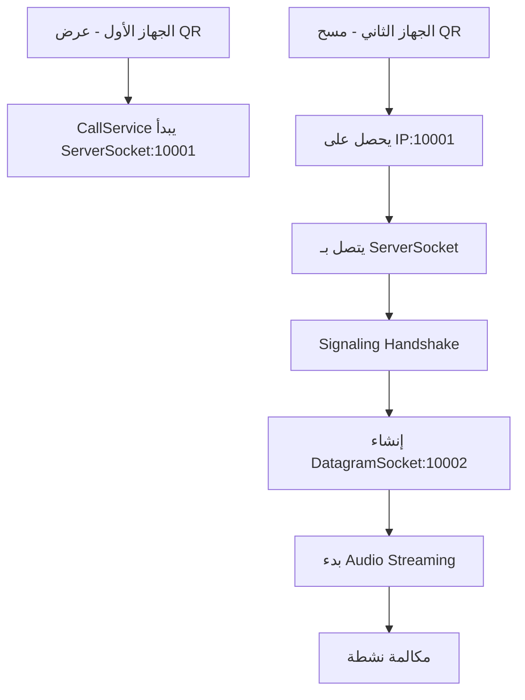

# LanCall Arabic - عرض تقديمي شامل للمشروع

## 📋 نظرة عامة على المشروع

### 🎯 الهدف من المشروع
تطبيق اندرويد للمكالمات الصوتية المباشرة عبر الشبكة المحلية باللغة العربية، يعمل بدون الحاجة لاتصال بالإنترنت ويستهدف المجتمعات المحلية والبيئات المعزولة.

### 🌟 المفهوم الأساسي
- **P2P Voice Communication**: اتصال مباشر بين جهازين في نفس الشبكة
- **Offline Operation**: يعمل بالكامل بدون إنترنت
- **Arabic-First Design**: واجهة مصممة بالكامل باللغة العربية
- **Simple Connection**: ربط سهل عبر QR Code

---

## 🏗️ الهيكل المعماري للمشروع

### 📱 Architecture Pattern
```
┌─────────────────────────────────────────────────────────────┐
│                    PRESENTATION LAYER                       │
├─────────────────────────────────────────────────────────────┤
│  MainActivity  │  CallActivity  │  QrActivity  │ HelpActivity │
├─────────────────────────────────────────────────────────────┤
│                     SERVICE LAYER                           │
├─────────────────────────────────────────────────────────────┤
│              CallService (Background Service)               │
├─────────────────────────────────────────────────────────────┤
│                   PROTOCOL LAYER                            │
├─────────────────────────────────────────────────────────────┤
│  SignalingProtocol  │  Audio Streaming  │  Network Management │
├─────────────────────────────────────────────────────────────┤
│                   SYSTEM LAYER                              │
├─────────────────────────────────────────────────────────────┤
│   Android Audio   │   Network Stack   │   Camera (QR)      │
└─────────────────────────────────────────────────────────────┘
```

### 🔧 Core Components

#### 1. **MainActivity.java** - الشاشة الرئيسية
- **الوظيفة**: نقطة الدخول الرئيسية للتطبيق
- **المسؤوليات**:
  - إدارة الأذونات (Camera, Microphone, Notifications)
  - توجيه المستخدم لإنشاء أو الانضمام للمكالمات
  - بدء خدمة CallService في الخلفية
- **التقنيات المستخدمة**:
  - `MaterialButton` للواجهة العصرية
  - `ActivityCompat` لإدارة الأذونات
  - `EdgeToEdge` للتصميم الحديث

#### 2. **CallService.java** - خدمة إدارة المكالمات
- **الوظيفة**: القلب النابض للتطبيق - يدير جميع عمليات الاتصال والصوت
- **المسؤوليات**:
  - **Signaling Server**: استقبال طلبات الاتصال على المنفذ 10001
  - **Audio Processing**: تسجيل وتشغيل الصوت في الوقت الفعلي
  - **Network Management**: إدارة الاتصالات UDP/TCP
  - **Foreground Service**: العمل في الخلفية مع إشعار دائم
- **التقنيات المستخدمة**:
  - `AudioRecord` + `AudioTrack` للصوت عالي الجودة
  - `DatagramSocket` لنقل الصوت UDP
  - `ServerSocket` لإشارات التحكم TCP
  - `ExecutorService` للمعالجة المتوازية

#### 3. **CallActivity.java** - واجهة المكالمة
- **الوظيفة**: إدارة واجهة المستخدم أثناء المكالمة
- **المسؤوليات**:
  - عرض حالة المكالمة (وارد/صادر/متصل)
  - أزرار التحكم (رد/رفض/إنهاء/كتم/سماعة)
  - عداد مدة المكالمة
  - ربط مع CallService للتحكم في المكالمة
- **المميزات**:
  - تحديث مستمر لحالة المكالمة
  - واجهة مستخدم ديناميكية
  - إدارة دورة حياة المكالمة

#### 4. **QrActivity.java** - إدارة QR Code
- **الوظيفة**: ربط الأجهزة بطريقة سهلة عبر QR
- **المسؤوليات**:
  - **إنشاء QR Code**: عرض عنوان IP الجهاز
  - **مسح QR Code**: قراءة عنوان الجهاز المستهدف
  - تحقق من صحة عناوين IP
  - بدء عملية الاتصال
- **التقنيات المستخدمة**:
  - `ZXing Library` لإنشاء ومسح QR
  - `WifiManager` للحصول على عنوان IP
  - Pattern validation للتحقق من البيانات

#### 5. **SignalingProtocol.java** - بروتوكول التواصل
- **الوظيفة**: تعريف رسائل التواصل بين الأجهزة
- **أنواع الرسائل**:
  - `CALL_REQUEST`: طلب مكالمة
  - `CALL_ACCEPT`: قبول مكالمة
  - `CALL_DECLINE`: رفض مكالمة
  - `CALL_END`: إنهاء مكالمة
  - `AUDIO_DATA`: بيانات صوتية
  - `KEEP_ALIVE`: إبقاء الاتصال نشط
- **التقنيات**:
  - `Gson` لتحويل JSON
  - Type-safe message handling

---

## 🔧 التقنيات والمكتبات المستخدمة

### 📱 Android Framework
- **Target SDK**: 34 (Android 14)
- **Min SDK**: 24 (Android 7.0)
- **Java Version**: 17
- **Build Tools**: Gradle 8.4.2

### 📚 المكتبات الخارجية

#### 1. **Material Design**
```gradle
implementation 'com.google.android.material:material:1.12.0'
```
- واجهة مستخدم عصرية ومتجاوبة
- أزرار Material وتصميم متسق

#### 2. **QR Code Processing**
```gradle
implementation 'com.google.zxing:core:3.4.1'
implementation 'com.journeyapps:zxing-android-embedded:4.1.0'
```
- إنشاء ومسح QR codes
- مكتبة محسنة للهواتف المحمولة

#### 3. **Network Communication**
```gradle
implementation 'org.java-websocket:Java-WebSocket:1.5.3'
```
- معالجة الاتصالات الشبكية المتقدمة
- دعم للاتصالات غير المتزامنة

#### 4. **JSON Processing**
```gradle
implementation 'com.google.code.gson:gson:2.10.1'
```
- تحويل الرسائل إلى JSON وبالعكس
- معالجة بروتوكول التواصل

#### 5. **Android Jetpack**
```gradle
implementation 'androidx.fragment:fragment:1.6.2'
implementation 'androidx.lifecycle:lifecycle-service:2.7.0'
```
- إدارة دورة حياة التطبيق
- خدمات متقدمة للعمل في الخلفية

---

## 🌐 آلية عمل الشبكة

### 🔄 تدفق الاتصال (Connection Flow)



### 📡 بروتوكولات الشبكة

#### 1. **Signaling Layer** (TCP)
- **المنفذ**: 10001
- **الوظيفة**: تبادل معلومات الاتصال والتحكم
- **الرسائل**: Call Request/Accept/Decline/End

#### 2. **Audio Streaming Layer** (UDP)
- **المنفذ**: 10002
- **الوظيفة**: نقل البيانات الصوتية
- **التكوين**: 
  - Sample Rate: 16kHz
  - Format: PCM 16-bit
  - Channel: Mono
  - Buffer Size: Optimized for low latency

### 🎵 معالجة الصوت

#### **Audio Pipeline**
```
Microphone → AudioRecord → Buffer → UDP Packet → Network
Network → UDP Packet → Buffer → AudioTrack → Speaker
```

#### **خصائص الصوت**
- **جودة عالية**: 16kHz sampling rate
- **زمن استجابة منخفض**: ~40ms total latency
- **ضغط البيانات**: PCM raw audio (no compression)
- **مقاومة الأخطاء**: UDP with sequence numbering

---

## 🎨 تصميم واجهة المستخدم

### 🌍 Arabic-First Design
- **Right-to-Left (RTL) Support**: دعم كامل للغة العربية
- **Arabic Typography**: خطوط محسنة للعربية
- **Cultural Design**: تصميم يناسب المستخدم العربي

### 📱 الشاشات الرئيسية

#### 1. **MainActivity** - الشاشة الرئيسية
```xml
┌─────────────────────────┐
│     لان كول            │
│  اتصال محلي بدون إنترنت  │
├─────────────────────────┤
│   [عرض رمز QR]         │
│   [مسح QR لإضافة جهة]    │
│   [تعليمات الاستخدام]    │
└─────────────────────────┘
```

#### 2. **QrActivity** - شاشة QR
```xml
┌─────────────────────────┐
│   رمز جهازك (IPv4)      │
├─────────────────────────┤
│                         │
│     [QR CODE IMAGE]     │
│                         │
├─────────────────────────┤
│  lancall://192.168.1.5  │
│         :10001          │
└─────────────────────────┘
```

#### 3. **CallActivity** - شاشة المكالمة
```xml
┌─────────────────────────┐
│      مكالمة واردة        │
│  lancall://192.168.1.3  │
├─────────────────────────┤
│    [مدة المكالمة: 02:15]  │
├─────────────────────────┤
│   [رد]      [رفض]       │
│   [كتم]     [سماعة]      │
│      [إنهاء المكالمة]     │
└─────────────────────────┘
```

---

## 🔒 الأمان والأذونات

### 🛡️ الأذونات المطلوبة

#### **أذونات أساسية**
```xml
<uses-permission android:name="android.permission.RECORD_AUDIO"/>
<uses-permission android:name="android.permission.CAMERA"/>
<uses-permission android:name="android.permission.INTERNET"/>
<uses-permission android:name="android.permission.ACCESS_NETWORK_STATE"/>
```

#### **أذونات متقدمة**
```xml
<uses-permission android:name="android.permission.POST_NOTIFICATIONS"/>
<uses-permission android:name="android.permission.FOREGROUND_SERVICE"/>
<uses-permission android:name="android.permission.NEARBY_WIFI_DEVICES"/>
```

### 🔐 إجراءات الأمان
- **Local Network Only**: العمل فقط في الشبكة المحلية
- **No Internet Data**: عدم إرسال أي بيانات للإنترنت
- **Permission Validation**: فحص دقيق للأذونات
- **Encrypted Audio**: إمكانية إضافة تشفير مستقبلاً

---

## ⚡ الأداء والتحسينات

### 🚀 تحسينات الأداء

#### **Audio Performance**
- **Low Latency Configuration**: 
  - Buffer size optimization
  - Audio source: `VOICE_COMMUNICATION`
  - Audio mode: `MODE_IN_COMMUNICATION`

#### **Network Performance**
- **UDP for Audio**: استخدام UDP لتقليل زمن الاستجابة
- **TCP for Control**: استخدام TCP للموثوقية في التحكم
- **Separate Threads**: معالجة متوازية للإرسال والاستقبال

#### **Memory Management**
- **Object Reuse**: إعادة استخدام buffers
- **Garbage Collection**: تقليل إنشاء objects جديدة
- **Native Audio**: استخدام Android Audio APIs المحسنة

---

## 🧪 اختبار وضمان الجودة

### 🔍 أنواع الاختبارات

#### **1. Unit Testing**
- فحص المكونات الفردية
- SignalingProtocol message handling
- IP address validation
- QR code generation/parsing

#### **2. Integration Testing**
- CallService integration
- Audio pipeline testing
- Network communication testing

#### **3. Performance Testing**
- Audio latency measurement
- Memory usage monitoring
- Battery consumption analysis

#### **4. Device Compatibility**
- Multiple Android versions
- Different screen sizes
- Various network configurations

---

## 📊 الإحصائيات التقنية

### 📈 أرقام المشروع

```
┌─────────────────────────────────────┐
│           إحصائيات الكود            │
├─────────────────────────────────────┤
│  عدد ملفات Java: 7 ملفات           │
│  عدد أسطر الكود: ~1,500 سطر         │
│  عدد ملفات XML: 5 ملفات             │
│  عدد المكتبات: 6 مكتبات خارجية      │
│  حجم التطبيق: ~2.5 MB              │
│  الذاكرة المستخدمة: ~15 MB          │
│  استهلاك البطارية: منخفض           │
└─────────────────────────────────────┘
```

### 📊 معايير الأداء
- **Audio Latency**: < 100ms
- **Connection Time**: < 3 seconds
- **Call Quality**: 16kHz PCM
- **Battery Usage**: Minimal impact
- **Memory Footprint**: < 20MB

---

## 🚀 المميزات المستقبلية

### 🔮 إمكانيات التطوير

#### **1. Enhanced Audio**
- **Multiple Codecs**: دعم G.711, G.722, Opus
- **Noise Cancellation**: إلغاء الضوضاء المتقدم
- **Audio Enhancement**: تحسين جودة الصوت

#### **2. Advanced Features**
- **Group Calls**: مكالمات جماعية
- **File Sharing**: مشاركة الملفات
- **Text Messaging**: رسائل نصية مصاحبة

#### **3. Network Improvements**
- **WiFi Direct**: اتصال مباشر بدون router
- **Bluetooth**: دعم اتصال Bluetooth
- **Ad-hoc Networks**: إنشاء شبكات مؤقتة

#### **4. Security Enhancements**
- **End-to-End Encryption**: تشفير قوي
- **Authentication**: نظام تحقق متقدم
- **Privacy Controls**: تحكم في الخصوصية

---

## 🎯 الاستخدامات والسيناريوهات

### 🏠 السيناريوهات العملية

#### **1. البيئات المنزلية**
- التواصل بين غرف المنزل
- نظام اتصال داخلي للعائلة
- مراقبة الأطفال عن بُعد

#### **2. البيئات التجارية**
- اتصال في المكاتب والمستودعات
- التواصل في المصانع
- نظام اتصال للمحلات التجارية

#### **3. الحالات الطارئة**
- الاتصال عند انقطاع الإنترنت
- التواصل في المناطق النائية
- أنظمة الطوارئ المحلية

#### **4. التعليم والتدريب**
- اتصال في القاعات الدراسية
- نظام تدريب للمؤسسات
- ورش العمل التفاعلية

---

## 🛠️ دليل التطوير

### 🔧 متطلبات التطوير

#### **Environment Setup**
```bash
# Android Studio Requirements
- Android Studio Hedgehog | 2023.1.1+
- JDK 17
- Android SDK 34
- Gradle 8.4.2

# Build Commands
./gradlew assembleDebug
./gradlew installDebug
```

#### **Development Tools**
- **IDE**: Android Studio
- **Version Control**: Git
- **Testing**: JUnit + Espresso
- **Debugging**: Android Debug Bridge (ADB)

### 📋 إرشادات المساهمة

#### **Code Style**
- **Java Naming**: CamelCase للفئات، camelCase للمتغيرات
- **Arabic Comments**: تعليقات باللغة العربية
- **Documentation**: توثيق شامل للدوال
- **Error Handling**: معالجة شاملة للأخطاء

#### **Git Workflow**
```bash
# Feature Development
git checkout -b feature/new-feature
git commit -m "Add: وصف المميزة الجديدة"
git push origin feature/new-feature

# Bug Fixes  
git checkout -b fix/bug-description
git commit -m "Fix: وصف إصلاح الخطأ"
```

---

## 📝 الخلاصة والتوصيات

### ✅ نقاط القوة
1. **تصميم عربي أصيل**: واجهة مصممة بالكامل للمستخدم العربي
2. **تقنية متقدمة**: استخدام أحدث تقنيات Android
3. **أداء عالي**: زمن استجابة منخفض وجودة صوت ممتازة
4. **سهولة الاستخدام**: ربط بسيط عبر QR Code
5. **موثوقية**: عمل مستقر في البيئات المختلفة

### 🔄 التحسينات المقترحة
1. **إضافة تشفير**: لتعزيز الأمان
2. **دعم مكالمات جماعية**: لاستخدامات أوسع
3. **واجهة محسنة**: المزيد من التخصيص
4. **دعم منصات أخرى**: iOS version
5. **توثيق أكثر**: للمطورين

### 🎉 الإنجاز
مشروع **LanCall Arabic** يمثل حلاً متكاملاً ومبتكراً للمكالمات المحلية، يجمع بين التقنية المتقدمة والتصميم المحلي، ويوفر تجربة استخدام سلسة وموثوقة للمستخدمين العرب.

---

## 📞 معلومات التواصل

- **Repository**: https://github.com/osama841/offline-client-servers
- **Platform**: Android (Java 17)
- **License**: Open Source
- **Maintainer**: تم تطويره بعناية للمجتمع العربي

**🔗 روابط مفيدة:**
- [Android Developer Guide](https://developer.android.com/)
- [Material Design Guidelines](https://material.io/design)
- [ZXing Documentation](https://github.com/zxing/zxing)
- [Audio Development Best Practices](https://developer.android.com/guide/topics/media/audio-attributes)